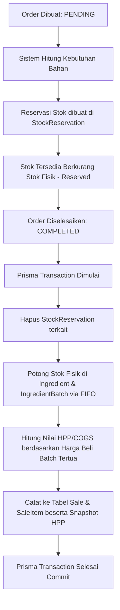
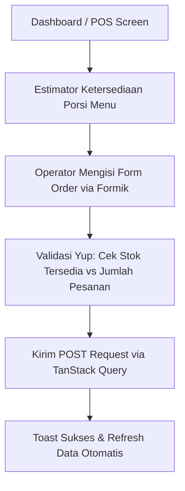

# ☕ CoffeBar - Premium Coffee Shop Management System

CoffeBar adalah platform manajemen operasional dan keuangan kedai kopi tingkat lanjut yang dirancang untuk membantu pemilik dan barista mengelola kasir (POS), stok inventaris dengan metode FIFO, reservasi stok otomatis, rekomendasi belanja bahan baku, laporan laba-rugi real-time, audit rekonsiliasi kas harian, serta pelacakan konsumsi internal staf.

Proyek ini dibangun menggunakan arsitektur **Monorepo** yang memisahkan aplikasi menjadi dua bagian utama: **Frontend (React + Vite)** dan **Backend (NestJS + Prisma + PostgreSQL)**.

---

## 📁 Struktur Proyek

```text
CoffeBar/
├── backend/          # REST API Backend menggunakan NestJS & Prisma
│   ├── src/          # Sumber kode backend (Modular per fitur)
│   ├── prisma/       # Skema database & file migrasi
│   └── test/         # Pengujian integrasi & unit testing
│
├── frontend/         # Dashboard & POS Frontend menggunakan React + Vite
│   ├── src/          # Sumber kode frontend (Feature-based structure)
│   │   ├── components/ # Reusable UI components & layouts
│   │   ├── context/    # Global context (Toast, Auth, dll.)
│   │   └── features/   # Modul fitur terisolasi (hooks, components, types)
│   └── public/       # Aset statis frontend
│
└── .agents/          # Riwayat pengembangan & aturan untuk AI Assistant
```

---

## ⚙️ Alur & Arsitektur Backend (NestJS)

Backend bertindak sebagai penyedia API RESTful yang aman, transparan, dan tangguh untuk mendukung operasi kedai kopi.

### 1. Model Data & Database Layer (Prisma ORM)
Database PostgreSQL dikelola melalui Prisma ORM dengan relasi utama sebagai berikut:
- **`Ingredient` & `IngredientBatch`**: Mengelola bahan baku dan kemasan (cup) menggunakan batch belanja individual untuk melacak harga beli yang bervariasi.
- **`StockReservation`**: Menampung kuantitas bahan resep yang sedang terkunci oleh pesanan aktif (Status: `PENDING` atau `CONFIRMED`).
- **`Order` & `OrderItem`**: Menyimpan pesanan kasir, preferensi pelanggan (sugar level, extra toppings, produk lepasan), serta status pembayaran.
- **`Sale` & `SaleItem`**: Menyimpan data penjualan riil setelah pesanan diselesaikan (`COMPLETED`), termasuk snapshots Harga Pokok Penjualan (HPP) / COGS saat transaksi.
- **`CashReconciliation`**: Audit harian kas laci kas fisik dibandingkan dengan catatan digital penjualan.

### 2. Alur Proses Transaksi & FIFO Inventory Billing
Proses pembuatan hingga penyelesaian pesanan berjalan secara transaksional di backend:

- **Stock Reservation**: Menjamin bahan baku tidak terjual ganda (*double-count*) ke antrean pesanan lain. Selama pesanan berstatus `PENDING` atau `CONFIRMED`, stok dibekukan di level reservasi.
- **FIFO (First-In, First-Out) Deduction**: Ketika memotong stok fisik, sistem mengambil dari batch belanja terlama (`IngredientBatch` dengan `remainingStock > 0` terlama). Jika batch tersebut habis, sistem berlanjut ke batch berikutnya secara berurutan. Ini menghasilkan kalkulasi HPP dan Margin Laba Rugi yang sangat akurat.

### 3. Rekonsiliasi Kas & Tutup Buku Harian
Setiap akhir shift/hari, kasir melakukan input kas fisik aktual yang ada di laci kas.
- Jika terjadi **selisih kas** (catatan sistem vs fisik), modul `ReconciliationsService` mencatat audit selisih beserta alasan penjelasnya.
- Apabila opsi penyesuaian otomatis diaktifkan, sistem secara otomatis menerbitkan entri penyeimbang (entri Pengeluaran/Pendapatan non-stok) untuk menyelaraskan arus kas.

### 4. Logging & Keamanan Operasi
Seluruh service penting menggunakan **Structured Logger** bawaan NestJS (`@nestjs/common`). Setiap operasi database penting dilindungi dengan blok `try-catch` terisolasi untuk mencatat *error message* dan *stack trace* sebelum mengirimkan response HTTP ke klien, menjamin kemudahan *debugging* di lingkungan produksi.

---

## 🎨 Alur & Arsitektur Frontend (React + Vite + TS)

Aplikasi klien dibangun dengan penekanan pada estetika premium, performa tinggi, dan struktur kode yang modular.

### 1. Struktur Folder Berbasis Fitur (Feature-Based / Co-location)
Untuk menghindari tumpukan file yang berantakan, kode frontend dikelompokkan berdasarkan domain fitur di dalam `src/features/[nama-fitur]/`. Setiap folder fitur memiliki:
- `components/` - Komponen UI khusus untuk fitur tersebut (misal: `OrderForm.tsx`, `EstimatorCard.tsx`).
- `hooks/` - Custom react hooks untuk komunikasi API menggunakan TanStack Query.
- `types.ts` - Definisi tipe TypeScript yang disesuaikan untuk fitur tersebut.

### 2. State Management & Server-State Synchronization
- **TanStack Query (React Query)**: Digunakan untuk seluruh aksi penarikan data (queries) dan manipulasi data (mutations). Ini mengeliminasi kebutuhan state global yang rumit, memberikan mekanisme caching otomatis, re-fetching latar belakang, serta optimasi performa.
- **Formik & Yup**: Seluruh pengisian form (tambah menu, belanja bahan baku, pencatatan pesanan, rekonsiliasi kas) menggunakan Formik (`useFormik`). Aturan validasi didefinisikan secara terpisah menggunakan skema **Yup** di file pendukung fitur untuk menjaga UI tetap bersih.

### 3. Alur UI Utama (User Flow di Frontend)


- **Kalkulator & Estimator Porsi Real-Time**: Ketika kasir memilih menu di halaman pemesanan, frontend secara dinamis menghitung kapasitas porsi maksimal yang bisa dibuat berdasarkan *limiting ingredient* (bahan dengan sisa stok paling kritis di database).
- **Date Filter Bar Global**: Pada halaman Laporan, pengguna dapat menyaring data berdasarkan rentang tanggal tertentu. Sistem akan menampilkan tren pendapatan harian (menggunakan **Recharts**), persentase pertumbuhan dibanding periode sebelumnya, serta melacak anggaran konsumsi internal staf secara dinamis.
- **Toast Notifications Terintegrasi**: Peringatan sukses/error dipicu langsung dari callbacks `onSuccess` atau `onError` di tingkat custom hooks React Query menggunakan `ToastContext` kustom dengan visual HSL premium.

---

## 🚀 Panduan Instalasi & Menjalankan Aplikasi

### Prasyarat
- Node.js (v18 ke atas)
- PostgreSQL Database
- npm atau yarn

### 1. Pengaturan Backend
1. Masuk ke direktori backend:
   ```bash
   cd backend
   ```
2. Instal dependensi:
   ```bash
   npm install
   ```
3. Salin file lingkungan (`.env`) dan konfigurasikan URL database PostgreSQL Anda:
   ```bash
   cp .env.example .env   # (Sesuaikan DATABASE_URL di dalam file .env)
   ```
4. Jalankan migrasi database Prisma untuk menyelaraskan skema tabel:
   ```bash
   npx prisma db push
   ```
5. Jalankan backend dalam mode pengembangan:
   ```bash
   npm run start:dev
   ```
   *Backend secara default berjalan di `http://localhost:3000`*

### 2. Pengaturan Frontend
1. Masuk ke direktori frontend:
   ```bash
   cd ../frontend
   ```
2. Instal dependensi:
   ```bash
   npm install
   ```
3. Jalankan aplikasi frontend dalam mode pengembangan:
   ```bash
   npm run dev
   ```
   *Frontend secara default berjalan di `http://localhost:5173`*

---

## 🧪 Menjalankan Pengujian (Testing)
Untuk memverifikasi fungsionalitas logika bisnis, Anda dapat menjalankan test suite terintegrasi pada backend:
```bash
cd backend
npm run test           # Menjalankan unit tests
npm run test:e2e       # Menjalankan integration/end-to-end tests
```

---
*Dikembangkan dengan ❤️ untuk kemudahan pengelolaan operasional coffee shop modern.*
